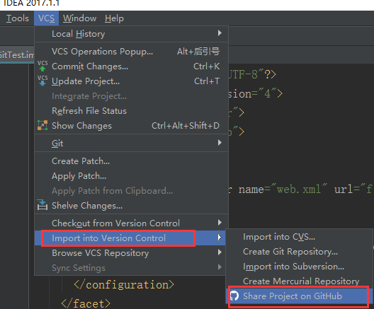
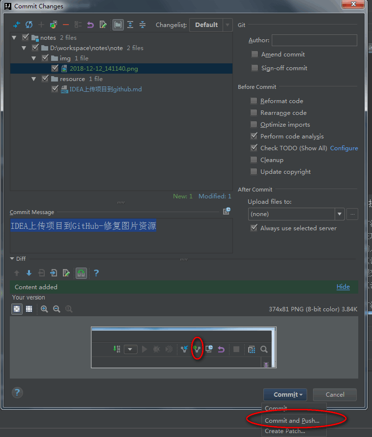

# [目录](../directory.md)
#### 说明

* 在idea中创建一个项目并上传到Github

#### 参考文献
1.[IDEA配置github并上传项目](https://www.cnblogs.com/jinjiyese153/p/6796668.html)

* 创建项目
* 上传  
VCS-->Import into Version Control-->Share Project on GitHub，
在弹框中输入仓库名和描述，点击Share，即可是上传，中间会弹窗输入GitHub的用户名和密码（已输入过用户名和密码并记住的不会再次弹框输入），上传成功后IDEA右下角会给出提示  
  
* 提交修改文件到GitHub  
>方法1：  
在项目右键-->Git-->Commit Directory，查看有变动的文件并输入Commit Message  
点击Commit and Push...  
提交后会进行语法检查，若存在错误或警告会给出确认提示，点击Commit，弹出Push框，点击Push，上传GitHub成功  

>方法2：  
点击idea右上角上传commit按钮
   
注意：要选择commit and push,如果不小心只commit了，则需要再单独push才能上传到GitHub

